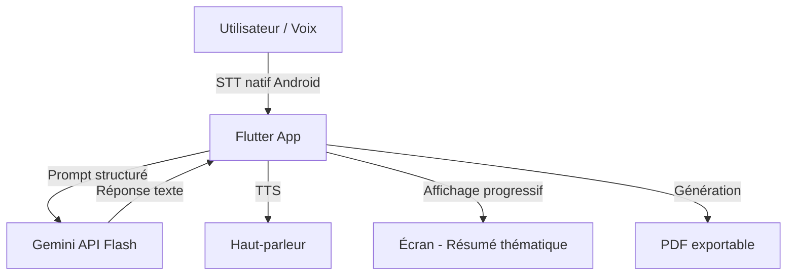
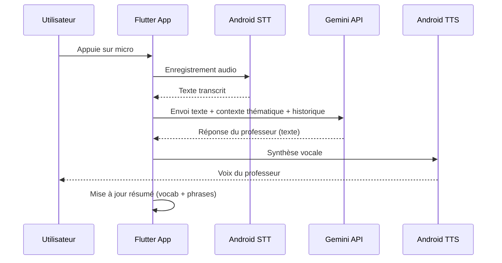

# Architecture — Talkie

## 1. System Overview



## 2. Data Flow — Session de dialogue



## 3. Stack Details

| Couche | Technologie | Justification |
|---|---|---|
| App mobile | Flutter (Dart) | Performance native, UI moderne, cross-platform Android |
| LLM / IA | Gemini 2.0 Flash API | Free tier généreux (~1M tokens/jour), multimodal, rapide |
| Speech-to-Text | Android SpeechRecognizer (natif) | Gratuit, hors ligne possible, intégré |
| Text-to-Speech | Flutter TTS / Android TTS | Gratuit, voix naturelles, plusieurs langues |
| Génération PDF | package `pdf` (Dart) | Client-side, gratuit, full contrôle mise en page |
| Stockage local | SharedPreferences + Hive | Sessions, historique, thèmes — aucun serveur |
| Sécurité clé API | Flutter dotenv + obfuscation | Clé non exposée dans le code source |

## 4. Folder Structure

```
Talkie/
├── lib/
│   ├── main.dart
│   ├── app/
│   │   ├── router.dart
│   │   └── theme.dart
│   ├── features/
│   │   ├── home/           # Écran d'accueil, choix thème
│   │   ├── session/        # Dialogue vocal avec le professeur
│   │   ├── summary/        # Résumé progressif vocab + phrases
│   │   └── export/         # Génération et téléchargement PDF
│   ├── services/
│   │   ├── gemini_service.dart
│   │   ├── stt_service.dart
│   │   ├── tts_service.dart
│   │   └── pdf_service.dart
│   └── models/
│       ├── session.dart
│       ├── theme_topic.dart
│       └── vocabulary_entry.dart
├── assets/
│   └── fonts/
├── docs/
│   ├── PRD.md
│   ├── ARCHITECTURE.md
│   └── ROADMAP.md
├── .env.example
├── .gitignore
└── CLAUDE.md
```

## 5. External Integrations

| Service | Usage | Auth |
|---|---|---|
| Gemini API (Google AI) | LLM professeur + structuration thème | API Key via `.env` |
| Android STT | Transcription voix → texte | Natif système, aucune clé |
| Android TTS | Synthèse voix du professeur | Natif système, aucune clé |

## 6. Security Architecture

- **Secret management** : clé Gemini dans `.env`, jamais dans le code — chargée via `flutter_dotenv`
- **Obfuscation** : build release avec `--obfuscate --split-debug-info`
- **Données locales** : tout stocké sur l'appareil (Hive), aucune donnée envoyée à des tiers sauf Gemini
- **API protection** : uniquement les prompts et réponses transitent — aucune donnée personnelle sensible
- **Pas de backend** : architecture 100% client-side → surface d'attaque minimale
